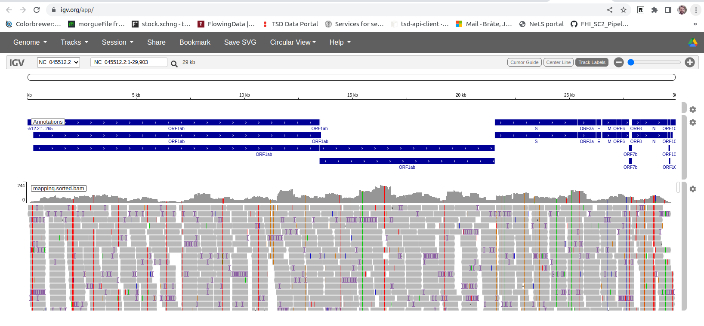

# Reference-based genome assembly  
The NCBI accession [NC_045512.2](https://www.ncbi.nlm.nih.gov/nuccore/NC_045512.2/) is the official reference genome for SARS-CoV-2, the so-called Wuhan-Hu-1. In the folder called `data` you will find a copy of this sequence in `fasta` format as well as a gene annotation in `gff` format.  

## Map reads to the genome

We first need to map the HiFi reads to the genome using Minimap2. Follow these commands (replace the fastq-file with the one you downloaded). You need to be directly inside the `Module-11-Genome-Assembly` folder:
```
# create results folder
mkdir -p results/mapping

# Map PacBio HiFi/CCS reads
conda activate MINIMAP2
minimap2 -ax map-pb data/NC_045512.fa FASTQ-FILE > results/mapping/mapping.sam
```

The `sam` file is a regular text file with tab-separated columns. Inspect the file using `less` (`less results/mapping/mapping.sam`) and answer the following questions:  

```diff
! How many lines does the sam header cover?
! What is the name of the first mapped read?
! At what position on the reference did the read map?
```

There is a lot of software developed for visualizing read mapping files. We will use [IGV](https://software.broadinstitute.org/software/igv/), which is a light-weight program that can view large files without requiring too much memory. You can either use IGV in the browser by clicking [here](https://igv.org/app/), or you can download the program and run it locally. To run it locally you need to have java installed and then follow these instructions [here](https://software.broadinstitute.org/software/igv/download). In this example I will use the browser version.

First we need to convert the sam file to a sorted bam file (the reads are ordered according to where they align to the genome) and then create and index of the file. This is required for loading the files into IGV. 

```
# Activate Samtools
module load SAMtools/1.11-GCC-10.2.0 

# Convert sam to bam and sort. Make sure you're in the results/mapping folder

samtools view -Sb results/mapping/mapping.sam | samtools sort - -o results/mapping/mapping.sorted.bam
samtools index results/mapping/mapping.sorted.bam
```
Download the `.bam` and `.bai` files to your computer. You can use a wildcard like this `*.bam*` in the `scp` command you used last week.

In IGV you first need to select the right genome. Click on "Genome" in the top left corner and select Sars-CoV-2. In the web-version click on "Tracks" and select both the `.bam` and `.bai` files. In the local version click on "File", "Load from file" and select only the `.bam` file (but the `.bai` must be in the same folder as the `.bam` file). You should see something like this:



Play around in IGV. For example; Zoom in on a particular region (e.g. by click and drag above the genome line on top or by the plus and minus buttons on the top right). Click on a read to see what happens. Click on the coverage track on top of the alignments to see how many nucletides are covered at each position.  

```diff
! What is the lowest and highest coverage you see in the mapping?
! Are there any regions where the coverage is zero?
! Mismathces to the reference are colored letters in the reads. Can you find a position in the genome where all or the majority of the reads have a mismatch to the reference (there should be plenty). Take  a note of the earliest position in the reference where you see such a mismatch. Note the position, the reference and the alternative nucleotide (ideally you should click on the bars indicating the coverage at that position and take a screenshot showing the information.)
```  

The `samtools` package contains many nice programs to work with mapping files. For example, `samtools depth -a` will print out the coverage at each position in the genome. Use this command to calculate the average coverage:  

```
samtools depth -a results/mapping/mapping.sorted.bam | awk '{sum+=$3} END { print "Average = ",sum/NR}'
```

```diff
! What do we mean by "coverage"? And what is the "average coverage"?
! Based on you visual inspection of the mapping in IGV, does this number look like a reasonable representation of the coverage?
```

## Create a consensus sequence

First we will create a so-called `pileup`, which converts the sam-file to a list of what nucleotides are at each position in the reference. `-a` tells the `mpileup` program to output all positions in the reference, including the ones with no coverage, `-B` turns off a special Q-score modification that `mpileup` can do, and `-d` sets the maximum number of reads per position that will be included. We will then use a program called `iVar` to generate the consensus sequence from the pileup.  

```
samtools mpileup -a -B -d 10000 -f data/NC_045512.fa results/mapping/mapping.sorted.bam > results/mapping/mapping.pileup
```

Inspect the pileup by using the `less` command. The first column shows the name of the reference, the second column shows the position in the reference, the third column shows the reference nucleotide, the fourth column shows the coverage at that position. The fifth column contains shows the read bases. A "." means identical to the reference on the positive strand and a "," means identical to the reference on the negative strand. "^]" means that the nucleotide was at the beginning of the read. 

```diff
! Do the pileup file correspond to what you see in IGV?
```  

Now we can use the information in the pileup file to make a consensus sequence from the mapping. (The iVar program require that we pipe the output from samtools mpileup).

```
conda activate IVAR
cat results/mapping/mapping.pileup | ivar consensus -m 10 -n N -p mapping 
```

The `-m` option sets the minimum coverage depth needed to call a nucleotide. `-n` specifies which letter to insert when the coverage is below the threshold. `-p` specifies a prefix used to name the output files.  

You should now have a file called `mapping.fa`. This is a fasta file of the consensus genome sequence created from the mapping. Inspect the file using `less` and answer the following questions:  

```diff
! Does the beginning of the consensus look correct compared to what you see in IGV?
! Why does the sequence begin with a series of N's?
! Can you locate the position of the first mismatch you noted previously? What is the nucleotide in the consensus sequence? Is this what you expected when you looked at the mapping?
```

Lastly we will calculate the "breadth" of coverage. That is, how much of the reference genome have we covered. We need to discard the N's for this calculation as these represent positions that we don't entirely trust. We use `grep` to remove the header line and `tr -d` to delete the "N" characters. Then we use `wc -c` to calculate how many letters we have in our sequence (assuming our sequence is on a single line). Then we divide that number by 29903 which is the length of the reference genome.

```
cat mapping.fa | grep -v "^>" | tr -d "N" | wc -c
```

```diff
! How much of the reference genome is covered?
```

Bonus exercise: 
Try to change the coverage cutoff for calling a nucleotide in iVar (`-m` option) and see the effects on the consensus sequence. Compare the changes to the mapping file in IGV and see oif it makes sense.

