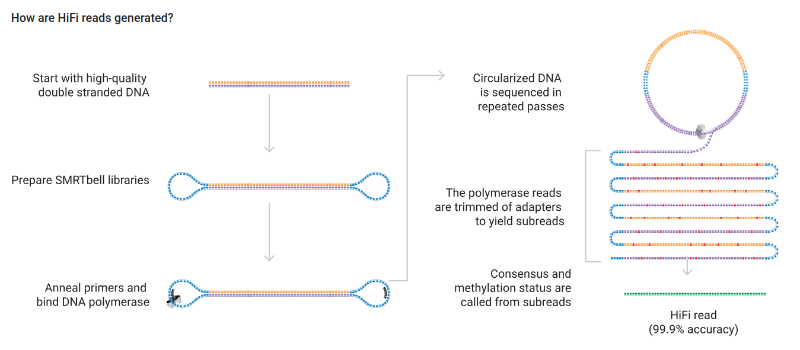
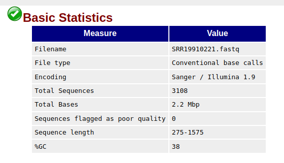
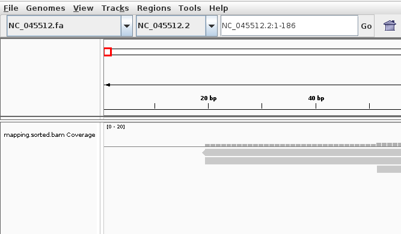
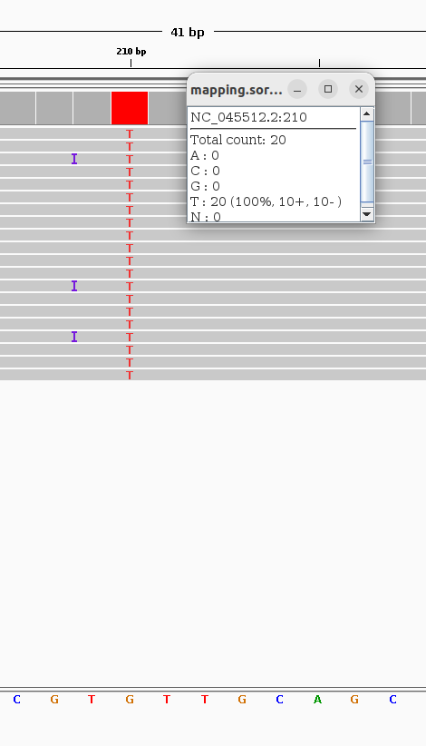

# Get fastq files

```bash
module load SRA-Toolkit/2.10.9-gompi-2020b
fastq-dump --outdir ~/Module-11-Genome-Assembly/data --split-3 SRR19910221
```  

You should now have the following content in the data folder:

```bash
ls ~/Module-11-Genome-Assembly/data
conda-ivar.yml  GCF_014621545.1_ASM1462154v1_genomic.fna  NC_045512.fa  NC_045512.gff  SRR19910221.fastq
```

Run FastQC:
```bash
module load FastQC/0.11.9-Java-11
fastqc SRR19910221.fastq
```

```diff
! How is the quality of these sequences compared to the Illumina sequences from Module 10?
```
The quality of these PacBio HiFi reads is much higher that the Illumina reads we looked at in Module 10. At least in the file I have used here. 

```diff
! Why is the quality of PacBio HiFi reads so high?
```  
PacBio HiFi reads are generated by circularizing the DNA template and thereby sequencing the fragment several times. The long read is then processed into sub-reads which are aligned and a consensus is generated:  

Image: pacb.com  
  

```diff
! How long is the shortest and longest read? How long are the majority of the reads? How is this length compared to the Illumina reads you looked at?
```

The reads in this example are from 275 to 1575 bp, with the majority of reads of ca. 725 bp (see the "Basic Statistics" and "Sequence Length Distribution" parts of the FastQC report). This is much longer than the Illumina reads we looked at in Module 10. However, PacBio reads can be much longer than this. Even HiFi reads. But these reads are from PCR amplicons of roughly 675 bp.  





```diff
! Are there any sequencing adapters in the reads that needs to be removed?  
````  
No. In making the HiFi reads, the adapters are removed when the so-called "subreads" are aligned to create a consensus sequence. See the image above. 

# Reference-based genome assembly
## Map reads to the genome
Map reads to the reference genome:
```bash
minimap2 -ax map-pb data/NC_045512.fa SRR19910221.fastq > results/mapping/mapping.sam
```  

Example output:
```bash
[M::mm_idx_gen::0.002*18.20] collected minimizers
[M::mm_idx_gen::0.003*12.39] sorted minimizers
[M::main::0.003*12.29] loaded/built the index for 1 target sequence(s)
[M::mm_mapopt_update::0.004*11.52] mid_occ = 10
[M::mm_idx_stat] kmer size: 19; skip: 10; is_hpc: 1; #seq: 1
[M::mm_idx_stat::0.004*10.89] distinct minimizers: 3925 (99.97% are singletons); average occurrences: 1.000; average spacing: 7.617; total length: 29903
[M::worker_pipeline::0.244*2.89] mapped 3108 sequences
[M::main] Version: 2.26-r1175
[M::main] CMD: minimap2 -ax map-pb NC_045512.fa SRR19910221.fastq
[M::main] Real time: 0.245 sec; CPU: 0.707 sec; Peak RSS: 0.013 GB
```
```diff
! How many lines does the sam header cover?
``` 
90204 lines:
```bash
wc -l results/mapping/mapping.sam
3116 results/mapping/mapping.sam
```

```diff
! What is the name of the first mapped read?
```  

SRR19910221.1
```bash
# First we check the length of the header
grep -c "^@" results/mapping/mapping.sam #"^@" means to find lines starting with "@". 
# The header covers three lines in this case
# We first pull out the first four lines, and then the last line
cat results/mapping/mapping.sam | head -n 4 | tail -n 1
```

```diff
! At what position on the reference did the read map?
```

The read mapping started on position 3866 in the reference genome. See the fourth column in the sam file:
```
SRR19910221.1   0       NC_045512.2     3866    60      5S67M1I7M1I123M1I60M1I186M2I171M1I2M1D96M4S     *       0       0       ACTGGCAAAAGATCGCTGAGATTCCTAAAGAGGAAGTTAAGCCATTTATAACTGAAAGTAAACCTTCAGTTGAAACAGAGAAAAACAAGATGATAAGAAAATCAAAGCTTGTGTTGAAGAAGTTACAACAACTCTGGAAGAAACTAAGTTCCTCACAGAAAACTTGTTACTTTATATTGACATTAATGGCAATCTTCATCCAGATTTCTGCCACTCTTGTTAGTGACATTGACATCACTTTCTTAAAGAAAGATGCTCCATATATGAGTGGGTGATGTTGTTCAAGAGGGTGTTTTAACTGCTGTGGTTATACCTACTAAAAAGTCTGGTGGCACTACTGAAATGCTAGCGAAAGCTTTGAGAAAAGTGCCAACAGACAATTATATAACCACTTACCCGGGTCAGGGTTTAAATGGTTACACTGTAGAGGAGGCAAAGACAGTGCTTAAAAAGTGTGTAAAAGTGCCTTTTACATTCTACCATCTATTATCTCTAATGAGAAGCAAGAAATTCTTGGAACTGTTTCTTGGAATTTGCGAGAAATGCTTGCACATGCAGAAGAAACACGCAAATTAATGCCTGTCTGTGTGGAAACTAAAGCCATAGTTTCAACTATACAGCGTAATATTAAGGGTATTAAAATACAAGAGGGTGTGGTTGATTATGGTGCTAGATTTTACTTTTACACCAGTAAAACAACTGTAGCGTCACTTATCAACACACTAGTA    j}yT~b&[VOfCMZi~~ny{ii~m~~=z`gbR~x~tK~emUUblH~~pgVwc~uH~rtxQ~zV~d~_ZYv~x+L`z[M:K(&@TWRv~xZW|~^GthL~~~nxi~_t~]qc~wIrlaxuUjiLz\]a~hZ~{oh~J~W[kTsoy{_zfV{IHzn~~wy4f|~|l|L[~~~A~~|~~b~~o^PCy]rk]vKX~B~gcz]q+}~hz(-W~~~/qen?G<vkG~~}~g~qLw~~~~z~~\Y_~umKvOY_aVwx~~ti{iSxudXZzb%WP~CkMkyo\TDsD:rUBdtbB~~~o?z~iRi]iiGI`~P~74PSj]x~}_~O~~~~nuc~Z~cQ~~~_N`Ran\~~mTTBytJwG[~\VR~kbuV=[velu~\~l~~n^~{T|\qrnXVa~e~{iS~]P~~P~~pm}Ow^']~K~~~r~@ip]wfx~~~~wU~~J~~FqGO}k}~na~_z1~xv~o=%D4Q7uoj|x~f~@~~{~[ML{~~}^~|~wk~a~nUNgiae~op~aTte~[|wHj~s~]W]b~~~~ts>~~~c~L~p{`~~o~u~~c~~~]qK~~~}~~~~~r~k~~Tkc^qIl6W}~f~`s~gx~~~~~u\wHN-b`~~n~^~~~]~iaRhf~~{Z~~k}pzova~B\%s+*@9S~Q~~]]/vHu~[Tpc[dY~P~~~~~Ix3~NhH~<O>rKc~~~gZGk~~~o@jFRnkv\{orkR~~~lQ~j~ty~~~~~}~~r~v~S<~}~~~~~~~~g      NM:i:9  ms:i:1375       AS:i:1374       nn:i:0  tp:A:P  cm:i:78 s1:i:690        s2:i:0  de:f:0.0111     rl:i:0
```

```diff
! What is the lowest and highest coverage you see in the mapping?
```
Lowest: 0
Highest: 244.
If you for example zoom all the way out, then the numbers in the coverage bar on top of the reads mapping will show this. 

```diff
! Are there any regions where the coverage is zero?
```
Yes. For example the first 19 bp of the reference: 


```diff
! Mismathces to the reference are colored letters in the reads. Can you find a position in the genome where all or the majority of the reads have a mismatch to the reference (there should be plenty). Take  a note of the earliest position in the reference where you see such a mismatch. Note the position, the reference and the alternative nucleotide (ideally you should click on the bars indicating the coverage at that position and take a screenshot showing the information.)
```  
At position 210 in the reference, all of the mapped reads have a "T" instead of a "G":
 

```diff
! What do we mean by "coverage"? And what is the "average coverage"?
! Based on you visual inspection of the mapping in IGV, does this number look like a reasonable representation of the coverage?
```
The average coverage is 73.97. Actually, you will learn about coverage next week. But coverage in this setting means how many reads mapped to a given position on the reference. And the average coverage is the average of this number for all the reference positions. I will say that this number looks reasonable.  

```bash
$ samtools depth -a results/mapping/mapping.sorted.bam | awk '{sum+=$3} END { print "Average = ",sum/NR}'
Average =  73,9711
```  

## Create a consensus sequence  

```diff
! Do the pileup file correspond to what you see in IGV?
```

Yes. We see that the first reported position with any reads covered is position 20 (column two). Then there are two reads mapping from position 20. And for example, at position 20 there are two identical nucleotides on the reads, they are both the first nucleotide of their read ("]"), and they map to different strands of the reference genome. However, this is not relevant for the kind of library we are working with. 

```
head -30 results/mapping/mapping.pileup 
NC_045512.2     1       A       0       *       *
NC_045512.2     2       T       0       *       *
NC_045512.2     3       T       0       *       *
NC_045512.2     4       A       0       *       *
NC_045512.2     5       A       0       *       *
NC_045512.2     6       A       0       *       *
NC_045512.2     7       G       0       *       *
NC_045512.2     8       G       0       *       *
NC_045512.2     9       T       0       *       *
NC_045512.2     10      T       0       *       *
NC_045512.2     11      T       0       *       *
NC_045512.2     12      A       0       *       *
NC_045512.2     13      T       0       *       *
NC_045512.2     14      A       0       *       *
NC_045512.2     15      C       0       *       *
NC_045512.2     16      C       0       *       *
NC_045512.2     17      T       0       *       *
NC_045512.2     18      T       0       *       *
NC_045512.2     19      C       0       *       *
NC_045512.2     20      C       2       ^].^],  ~~
NC_045512.2     21      C       2       .,      ~~
NC_045512.2     22      A       2       .,      ~~
NC_045512.2     23      G       2       .,      ~~
NC_045512.2     24      G       2       .,      ~~
NC_045512.2     25      T       2       .,      ~~
NC_045512.2     26      A       2       .,      ~~
NC_045512.2     27      A       2       .,      ~~
NC_045512.2     28      C       2       .,      ~~
NC_045512.2     29      A       2       .,      u~
NC_045512.2     30      A       2       .,      ~~
``` 

```diff
! Does the beginning of the consensus look correct compared to what you see in IGV?
! Why does the sequence begin with a series of N's?
```
The beginning of consensus sequence in this example looks like:
```
>Consensus_mapping_threshold_0_quality_20
NNNNNNNNNNNNNNNNNNNNNNNNNNNNNNNNNNNNNNNNNNNNNNNNNNNNNNNNNNNNNNNNNNNNNNNNNNNNNNNNNNNNNNNNNNNNNNNNNNNNNNNNNNNNNNNTAGTGCACTCACGCAGTATAATTAATAACTA
```
There are 111 N's in the beginning. If we go to position 112 in IGV we can see that from position 111 to 112 the coverage increases from 9 to 17. And we had set the threshold for calling a nucleotide to 10. Therefore there are N's up to position 112.

```diff
! Can you locate the position of the first mismatch you noted previously? What is the nucleotide in the consensus sequence? Is this what you expected when you looked at the mapping?
```
Yes, the consensus sequence at position 210 has a "T" instead of "G". 

There are 29541 nucleotides in the consensus sequence. This means that 98.79% of the reference is covered by our consensus sequence. I will say this is what we would expect by looking at the mapping in IGV.
