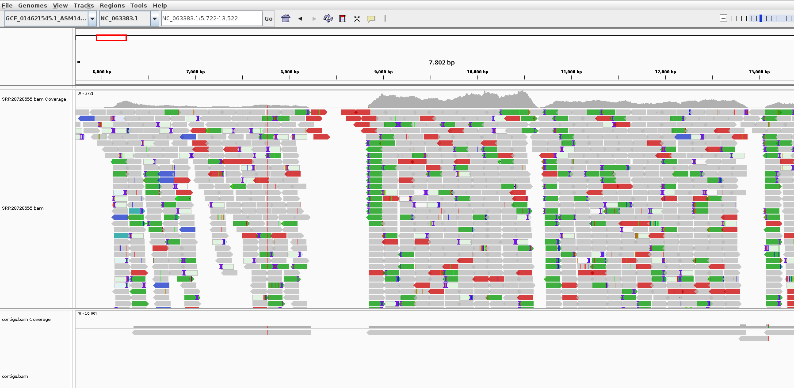

# _de novo_ genome assembly  

After Spades I have these files in a folder called `results/de_novo`:

```bash
$ ls -l results/de_novo/
total 444
-rw-r--r--. 1 jonbra 17400  29849 May  5 18:05 assembly_graph_after_simplification.gfa
-rw-r--r--. 1 jonbra 17400  60703 May  5 18:05 assembly_graph.fastg
-rw-r--r--. 1 jonbra 17400  29893 May  5 18:05 assembly_graph_with_scaffolds.gfa
-rw-r--r--. 1 jonbra 17400  30349 May  5 18:05 before_rr.fasta
-rw-r--r--. 1 jonbra 17400     77 May  5 18:05 contigs.paths
-rw-r--r--. 1 jonbra 17400     80 May  5 18:05 dataset.info
-rw-r--r--. 1 jonbra 17400   9094 May  5 18:05 domain_graph.dot
-rw-r--r--. 1 jonbra 17400   3987 May  5 18:05 hmm_statistics.txt
-rw-r--r--. 1 jonbra 17400    127 May  5 18:05 input_dataset.yaml
drwxr-xr-x. 6 jonbra 17400   4096 May  5 18:05 K127
drwxr-xr-x. 4 jonbra 17400     69 May  5 18:05 K21
drwxr-xr-x. 4 jonbra 17400     69 May  5 18:05 K33
drwxr-xr-x. 4 jonbra 17400     69 May  5 18:05 K55
drwxr-xr-x. 2 jonbra 17400      6 May  5 18:05 misc
-rw-r--r--. 1 jonbra 17400   1120 May  5 18:05 params.txt
drwxr-xr-x. 2 jonbra 17400   4096 May  5 18:05 pipeline_state
-rw-r--r--. 1 jonbra 17400  30349 May  5 18:05 raw_contigs.fasta
-rw-r--r--. 1 jonbra 17400  30349 May  5 18:05 raw_scaffolds.fasta
-rw-r--r--. 1 jonbra 17400     77 May  5 18:05 raw_scaffolds.paths
-rw-r--r--. 1 jonbra 17400   4501 May  5 18:05 run_spades.sh
-rw-r--r--. 1 jonbra 17400   5857 May  5 18:05 run_spades.yaml
-rw-r--r--. 1 jonbra 17400  30368 May  5 18:05 scaffolds.fasta
-rw-r--r--. 1 jonbra 17400 133100 May  5 18:05 spades.log
drwxr-xr-x. 2 jonbra 17400      6 May  5 18:05 tmp
```  

```diff
! How many scaffolds (fasta sequences) were assembled? Hint: there's an argument to the grep command that counts.
! How long are the scaffolds? (Hint: see the fasta headers)  
! How does this compare to the length of the reference-based assembly (not counting the N's)?
```

```bash
grep "^>" results/de_novo_mpox/scaffolds.fasta
>NODE_1_length_29817_cluster_1_candidate_1_domains_49
```


There were only a single scaffold assembled. It was 29817 bp long. The reference-based consensus sequence was 29540 bp.  


```diff
! Are there any differences between the two assemblies?
! Look at the start and stop positions of the alignment on the two sequences (Query and Subject). Do they start at the exact same positions?
! If you compare the de novo assembled genome with the mapping file you see in IGV, at roughly what coverage level did SPAdes assemble a sequence?
```  

The reference-based consensus and the de novo assembled scaffolds are identical. The "Alignments" tab of the blast results says that 29540 of the reference-based sequence had a 100% identity with 29540 of the de novo assembled sequence. But this also means that the de novo assembly was longer.  

  

Mapping the de novo assembly to the reference: 
```bash
conda activate MINIMAP2
minimap2 -a data/NC_045512.fa results/de_novo/scaffolds.fasta > de_novo.sam
module load SAMtools/1.10-GCC-9.3.0
samtools view -Sb de_novo.sam | samtools sort - -o de_novo.bam
samtools index de_novo.bam
```

We can see that the de novo assembly starts at position 20 on the reference. This is exactly where the first reads mapped. We can see that SPades has been less strict that we were when we made the consensus. We required a minimum of 10 reads mapped, which is why the consensus sequence started at position 112.  

# Assembly quality assessment  

```diff
! How many scaffolds and contigs were assembled?
```

```bash
$ grep -c "^>" results/de_novo_mpox/scaffolds.fasta
472

$ grep -c "^>" results/de_novo_mpox/contigs.fasta 
474
```  

There were 472 scaffolds and 474 contigs assembled.  

### Quality assessment with QUAST  

```diff
! What is the length of the longest contig?
! What is the contig N50 value?
! What is the size of the total assembly? How does this compare to the reference genome? How large fraction of the reference genome is covered (coverage breadth)?
! How many mismatches are there compared to the reference?
```

From the Quast report we can see that the longest contig is 25222 bp. This is much less than the expected genome size.  

The contig N50 value is 9692 bp. This means that half of the genome assembly is in contigs of this size or larger. 

The size of the total assembly (based on contigs >= 500 bp) is 182936 bp. This is 15.5 kbp shorter than the reference genome, but more than 90% of the genome is covered.

There are 36.78 mismatches per 100.000 bp (100 kbp). These are probably not assembly errors, but rather differences between the sequenced genome and the reference genome. And I would say that this is not a lot of mismatches.

```bash
cat quast_results/report.txt
$ cat quast_results/report.txt 
All statistics are based on contigs of size >= 500 bp, unless otherwise noted (e.g., "# contigs (>= 0 bp)" and "Total length (>= 0 bp)" include all contigs).

Assembly                     scaffolds 
# contigs (>= 0 bp)          472       
# contigs (>= 1000 bp)       27        
# contigs (>= 5000 bp)       14        
# contigs (>= 10000 bp)      5         
# contigs (>= 25000 bp)      1         
# contigs (>= 50000 bp)      0         
Total length (>= 0 bp)       234838    
Total length (>= 1000 bp)    177948    
Total length (>= 5000 bp)    147044    
Total length (>= 10000 bp)   86161     
Total length (>= 25000 bp)   25222     
Total length (>= 50000 bp)   0         
# contigs                    33        
Largest contig               25222     
Total length                 182936    
Reference length             197209    
GC (%)                       33.12     
Reference GC (%)             33.03     
N50                          9692      
NG50                         8329      
N75                          5392      
NG75                         4844      
L50                          6         
LG50                         7         
L75                          13        
LG75                         15        
# misassemblies              0         
# misassembled contigs       0         
Misassembled contigs length  0         
# local misassemblies        0         
# scaffold gap ext. mis.     0         
# scaffold gap loc. mis.     0         
# unaligned mis. contigs     0         
# unaligned contigs          0 + 0 part
Unaligned length             0         
Genome fraction (%)          90.980    
Duplication ratio            1.020     
# N's per 100 kbp            0.00      
# mismatches per 100 kbp     36.78     
# indels per 100 kbp         2.23      
Largest alignment            25082     
Total aligned length         180164    
NA50                         9692      
NGA50                        8256      
NA75                         5246      
NGA75                        4751      
LA50                         6         
LGA50                        7         
LA75                         13        
LGA75                        15        
```  

### Quality assessment with BUSCO  

```diff
! How many complete and fragmented BUSCO genes were found?
! Were there any missing genes?
! Were there any duplicated genes?
! Based on the BUSCO result, would you say that the assembly is complete?
```  
From the BUSCO report:
```bash
cat busco/short_summary.specific.poxviridae_odb10.busco.txt
# BUSCO version is: 5.0.0 
# The lineage dataset is: poxviridae_odb10 (Creation date: 2024-01-08, number of species: 39, number of BUSCOs: 18)
# Summarized benchmarking in BUSCO notation for file results/de_novo_mpox/scaffolds.fasta
# BUSCO was run in mode: genome
# Gene predictor used: prodigal

	***** Results: *****

	C:72.2%[S:72.2%,D:0.0%],F:27.8%,M:0.0%,n:18	   
	13	Complete BUSCOs (C)			   
	13	Complete and single-copy BUSCOs (S)	   
	0	Complete and duplicated BUSCOs (D)	   
	5	Fragmented BUSCOs (F)			   
	0	Missing BUSCOs (M)			   
	18	Total BUSCO groups searched	
```  

72% of the BUSCO genes were found as complete. This was 13 genes as complete and single-copy BUSCOs. This may not sound like a high number, however there were zero missing BUSCOs, and 5 fragmented BUSCOs detected. The dataset consisted of only 18 BUSCOs in total. Therefore I would say that the assembly is fairly complete, although not perfect.
  
**Bonus exercise**  
From a quick comparison of the reads mapping and the de novo assembled contigs I would say that the regions of the reference genomes with no contigs assembled roughly corresponds to areas with little or no coverage. For example:
  
