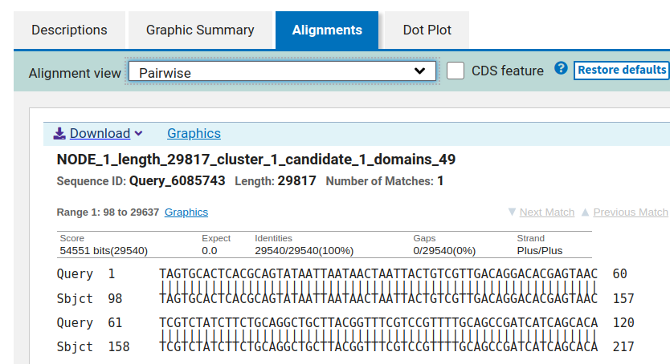

# _de novo_ genome assembly  

After Spades I have these files in a folder called `results/de_novo`:

```bash
$ ls -l results/de_novo/
total 444
-rw-r--r--. 1 jonbra 17400  29849 May  5 18:05 assembly_graph_after_simplification.gfa
-rw-r--r--. 1 jonbra 17400  60703 May  5 18:05 assembly_graph.fastg
-rw-r--r--. 1 jonbra 17400  29893 May  5 18:05 assembly_graph_with_scaffolds.gfa
-rw-r--r--. 1 jonbra 17400  30349 May  5 18:05 before_rr.fasta
-rw-r--r--. 1 jonbra 17400     77 May  5 18:05 contigs.paths
-rw-r--r--. 1 jonbra 17400     80 May  5 18:05 dataset.info
-rw-r--r--. 1 jonbra 17400   9094 May  5 18:05 domain_graph.dot
-rw-r--r--. 1 jonbra 17400   3987 May  5 18:05 hmm_statistics.txt
-rw-r--r--. 1 jonbra 17400    127 May  5 18:05 input_dataset.yaml
drwxr-xr-x. 6 jonbra 17400   4096 May  5 18:05 K127
drwxr-xr-x. 4 jonbra 17400     69 May  5 18:05 K21
drwxr-xr-x. 4 jonbra 17400     69 May  5 18:05 K33
drwxr-xr-x. 4 jonbra 17400     69 May  5 18:05 K55
drwxr-xr-x. 2 jonbra 17400      6 May  5 18:05 misc
-rw-r--r--. 1 jonbra 17400   1120 May  5 18:05 params.txt
drwxr-xr-x. 2 jonbra 17400   4096 May  5 18:05 pipeline_state
-rw-r--r--. 1 jonbra 17400  30349 May  5 18:05 raw_contigs.fasta
-rw-r--r--. 1 jonbra 17400  30349 May  5 18:05 raw_scaffolds.fasta
-rw-r--r--. 1 jonbra 17400     77 May  5 18:05 raw_scaffolds.paths
-rw-r--r--. 1 jonbra 17400   4501 May  5 18:05 run_spades.sh
-rw-r--r--. 1 jonbra 17400   5857 May  5 18:05 run_spades.yaml
-rw-r--r--. 1 jonbra 17400  30368 May  5 18:05 scaffolds.fasta
-rw-r--r--. 1 jonbra 17400 133100 May  5 18:05 spades.log
drwxr-xr-x. 2 jonbra 17400      6 May  5 18:05 tmp
```  

```diff
! How many scaffolds (fasta sequences) were assembled? Hint: there's an argument to the grep command that counts.
! How long are the scaffolds? (Hint: see the fasta headers)  
! How does this compare to the length of the reference-based assembly (not counting the N's)?
```

```bash
grep "^>" results/de_novo/scaffolds.fasta
>NODE_1_length_29817_cluster_1_candidate_1_domains_49
```


There were only a single scaffold assembled. It was 29817 bp long. The reference-based consensus sequence was 29540 bp.  


```diff
! Are there any differences between the two assemblies?
! Look at the start and stop positions of the alignment on the two sequences (Query and Subject). Do they start at the exact same positions?
! If you compare the de novo assembled genome with the mapping file you see in IGV, at roughly what coverage level did SPAdes assemble a sequence?
```  

The reference-based consensus and the de novo assembled scaffolds are identical. The "Alignments" tab of the blast results says that 29540 of the reference-based sequence had a 100% identity with 29540 of the de novo assembled sequence. But this also means that the de novo assembly was longer.  

  

Mapping the de novo assembly to the reference: 
```bash
conda activate MINIMAP2
minimap2 -a data/NC_045512.fa results/de_novo/scaffolds.fasta > de_novo.sam
module load SAMtools/1.10-GCC-9.3.0
samtools view -Sb de_novo.sam | samtools sort - -o de_novo.bam
samtools index de_novo.bam
```

We can see that the de novo assembly starts at position 20 on the reference. This is exactly where the first reads mapped. We can see that SPades has been less strict that we were when we made the consensus. We required a minimum of 10 reads mapped, which is why the consensus sequence started at position 112.  

# Assembly quality  


